## Practica 4.1: Configuración De Un Servidor DNS

## 1. Instalacion de Servidor DNS
Antes de comenzar la instalación del servidor DNS, debemso conectarnos por SSH a nuestra máquina física donde se ejecutarán los comandos necesarios para la instalación del servidor DNS. Para ello, utilizaremos el siguiente comando:
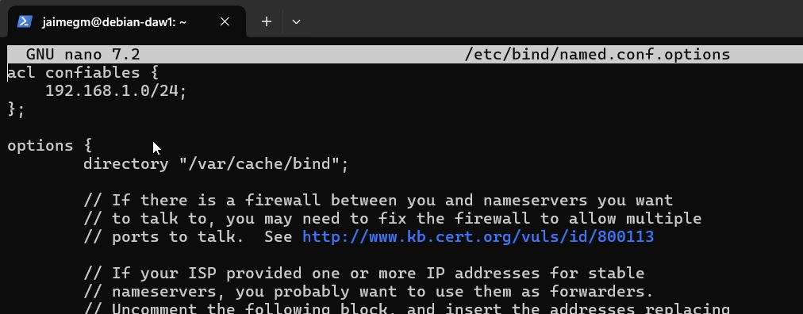

Para instalar el servidor DNS en nuestra máquina, utilizaremos el siguiente comando:
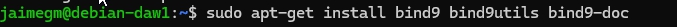

## 2. Configuración del Servidor DNS
Para configurar el servidor DNS, debemos modificar el archivo `/etc/default/named`. Dicho archivo, deberá tener la siguiente configuración:
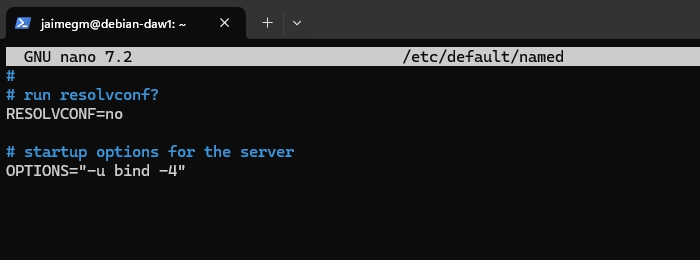

Ahora se comprobará el estado del archivo `/etc/bind/named.conf` para verificar que la configuración del servidor DNS es correcta:
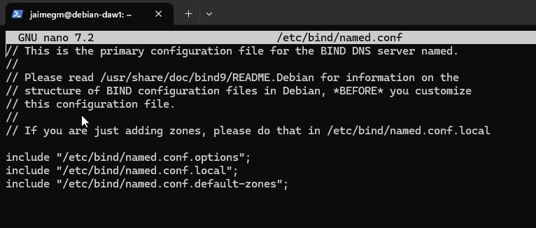

Esos tres archivos son los que se deben modificar para configurar el servidor DNS.

## 2.1. Configuracion de named.conf.options
Se recomienda siempre hacer una copia de seguridad del archivo antes de modificarlo. Para ello, utilizaremos el siguiente comando:

```bash
sudo cp /etc/bind/named.conf.options /etc/bind/named.conf.options.backup
```

Ahora, modificaremos el archivo `/etc/bind/named.conf.options`. Primeramente, se debe añadir estas lineas al inicio del archivo:

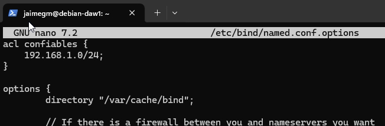

El tercer byte dependerá de la dirección IP de la máquina. En este caso, la dirección IP de la máquina es `192.168.1.59`, por lo que el tercer byte será `1`.

Seguidamente, se deberán añadir unas lineas y el archivo deberá quedar de la siguiente manera:
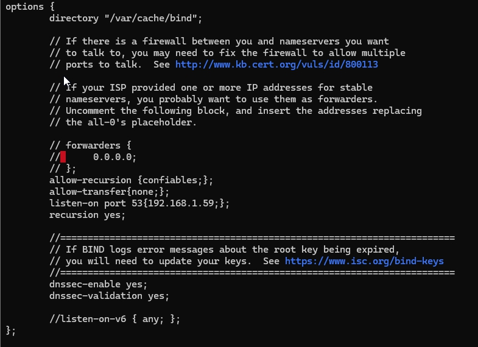

`allow-recursion {confiables;};`: Permite a los clientes hacer consultas recursivas.

`allow-transfer {none;};`: No permite transferencias de zona para evitar que se hagan transferencias de zona no autorizadas.

`listen-on port 53 {192.168.1.59;};`: Indica que el servidor DNS escuchará en el puerto 53 de la dirección IP `192.168.1.59`.

`recursion yes`: Permite hacer consultas recursivas.

`dnssec-validation yes;`: Habilita la validación de DNSSEC.

`dnsssec-enable yes;`: Habilita DNSSEC.

Se podrá comprobar que la configuración del archivo es correcta utilizando el siguiente comando:
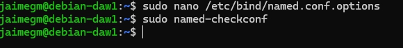
Si no sale nada, quiere decir que la configuración es correcta.

Ahora se reiniciará el servicio para que los cambios tengan efecto:
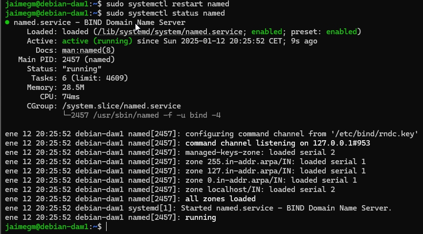

## 2.2. Configuración de named.conf.local
Se creará la zona `deaw.es` de la siguiente manera:
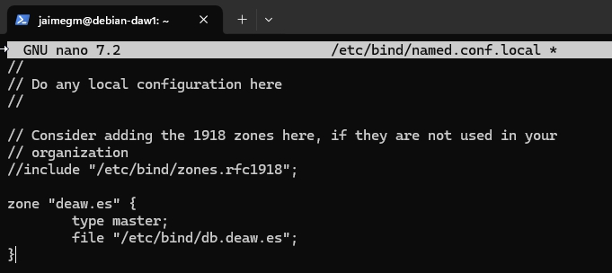

## 2.3. Creación del Archivo de Zona
El nombre del archivo de zona será `db.deaw.es`, como hemos indicado en el archivo `named.conf.local` y tendrá la siguiente configuración:

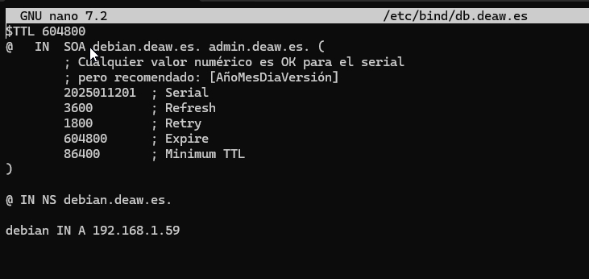

Los dos ultimos bytes de la dirección IP de la máquina son `1` y `59`, por lo que se deberá cambiar en el archivo de zona, dependiendo de la dirección IP de la máquina.

## 2.4. Creación del Archivo de Zona para la Resolución Inversa
Deben existir dos archivos de zona, uno para la resolución directa y otro para la resolución inversa. Para crear el archivo de zona para la resolución inversa. Primero se añaden las siguientes lineas al archivo `/etc/bind/named.conf.local`:

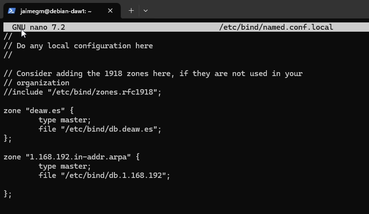

Ahora se creará el archivo de zona para la resolución inversa, llamado `db.1.168.192` y tendrá la siguiente configuración:

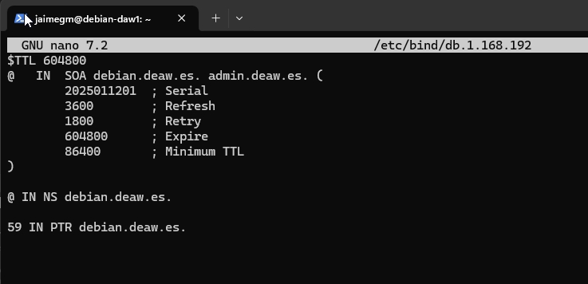

## 2.5. Comprobación de las Configuraciones
Para comprobar que la configuración de resolución directa e inversa se ejecutarán los siguientes comandos:
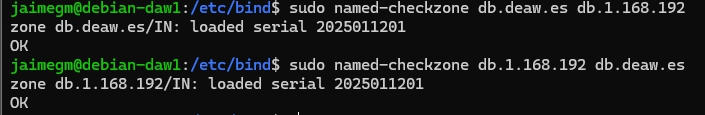

Si todo está correcto, el comando devolverá OK.

Ahora reiniciaremos el servicio para que los cambios tengan efecto:


## 2.6. Comprobación de las Resoluciones y de las Consultas
Antes de probar nada hay que establecer el cliente, para ello se utilizará una máquina virtual. Para ello, se debe configurar el archivo `/etc/resolv.conf` de la máquina virtual con la dirección IP del servidor DNS. Deberá quedar de la siguiente manera:

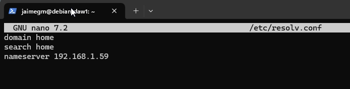

Hecho esto se comprobará que la resolución directa e inversa funciona correctamente. Para ello, se ejecutarán los siguientes comandos. Primero se utilizará `dig`.
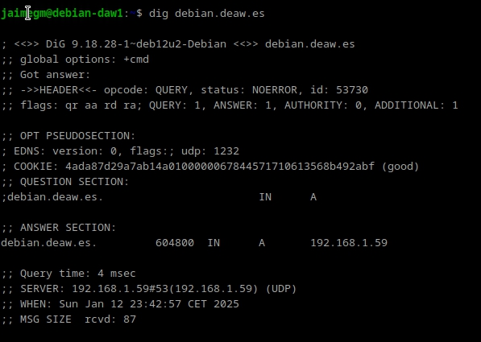

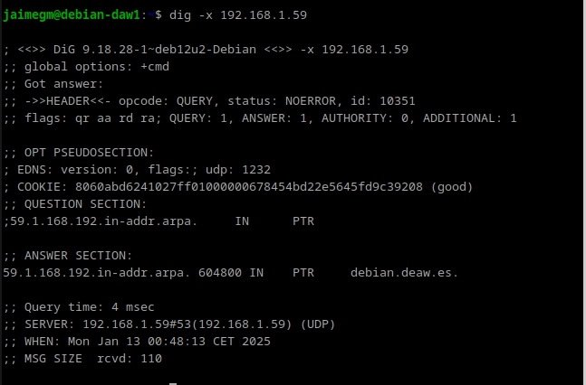

Ahora se utilizará `nslookup`.

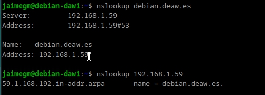

## Cuestiones Finales

### 1. ¿Qué pasará si un cliente de una red diferente a la tuya intenta hacer uso de tu DNS de alguna manera, le funcionará?¿Por qué, en qué parte de la configuración puede verse?

No funcionará, ya que en la configuración se ha restringido la recursión solo a los clientes confiables con la directiva:
`allow-recursion {confiables;};`
Esto significa que solo las direcciones IP definidas en "confiables" podrán realizar consultas recursivas. Si un cliente externo intenta resolver un dominio usando este DNS, su petición será rechazada.

### 2. ¿Por qué tenemos que permitir las consultas recursivas en la configuración?
Porque sin recursión, el servidor solo respondería por las zonas en las que es autoritativo y no resolvería nombres externos.

### 3. El servidor DNS que acabáis de montar, ¿es autoritativo?¿Por qué?
Sí, porque en la configuración se han definido zonas primarias con `"type master;"`.
Un servidor DNS es autoritativo cuando tiene registros DNS de una zona específica y puede responder con información definitiva sobre esos dominios.

### 4. ¿Dónde podemos encontrar la directiva $ORIGIN y para qué sirve?
La directiva $ORIGIN se encuentra en los archivos de zona y establece el dominio base para los registros.

### 5. ¿Una zona es idéntico a un dominio?
No necesariamente. Un dominio es un nombre dentro del sistema DNS. Una zona es una parte de un dominio gestionada por un servidor DNS específico.

### 6. ¿Pueden editarse los archivos de zona de un servidor esclavo/secundario?
No, los servidores secundarios obtienen los datos de un servidor maestro mediante transferencias de zona.

### 7. ¿Por qué podría querer tener más de un servidor esclavo para una misma zona?
Para mejorar la redundancia y la disponibilidad. Si un servidor secundario falla, los otros servidores secundarios pueden seguir respondiendo a las consultas.

### 8. ¿Cuántos servidores raíz existen?
Hay 13 servidores raíz de la A a la M.

### 9. ¿Qué es una consulta iterativa de referencia?
Es un tipo de consulta en la que un servidor DNS responde con la mejor información que tiene y, si no sabe la respuesta exacta, devuelve la dirección de otro servidor DNS más específico.
El cliente sigue consultando hasta obtener la respuesta final.

### 10. En una resolución inversa, ¿a qué nombre se mapearía la dirección IP 172.16.34.56?
56 IN PTR nombre_host.
